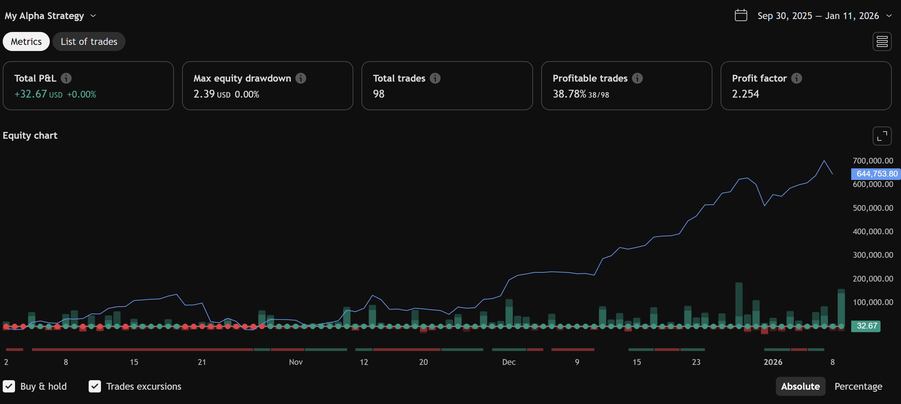

# EMA12–EMA26 Trading Strategy Example

This is a **visual example** of a simple trading strategy built using the Visual Trading Strategy Builder.  
The strategy uses **two exponential moving averages (EMAs)** to generate buy and sell signals.

---

## Strategy Overview

**Logic:**  

- **Buy Signal**: EMA12 crosses above EMA26  
- **Sell Signal**: EMA12 crosses below EMA26  
- **Stop-Loss**: Optional, set as a percentage below entry price  
- **Take-Profit**: Optional, set as a percentage above entry price  

This strategy demonstrates a basic **trend-following approach**, where trades are taken in the direction of the short-term EMA relative to the long-term EMA.

---

## How It Works

1. **EMA Calculation**:  
   - EMA12: Fast-moving average, responds quickly to price changes  
   - EMA26: Slow-moving average, responds more slowly  

2. **Crossover Signals**:  
   - When EMA12 crosses **above** EMA26 → Buy  
   - When EMA12 crosses **below** EMA26 → Sell  

3. **Risk Management (Optional)**:  
   - Stop-Loss and Take-Profit can be defined as percentages of the entry price  
   - Helps prevent large losses and lock in profits  

---

## Demo Screenshots

**Strategy Setup**

  
*Setting up EMA12 and EMA26 nodes.*

**Buy/Sell Signals on Chart**

  
*Buy and sell signals appear on the chart.*

**List of Trades**

  
*Buy and Sells Backtested.*

**Strategy Metrics on Tradingview**

  
*Visual representation of the Strategy Metrics on Tradingview.*

---

## How to Test

1. Open the Visual Trading Strategy Builder  
2. Create Strategy by following the Sample Setup
3. Observe signals on the chart or compile to Pine Script for TradingView  
4. Optional: Adjust parameters 

---

## Notes

- This example is **educational** and demonstrates how to construct a basic EMA crossover strategy.  
- Signals are generated visually in the builder; for live execution, the compiled script should be used on a trading platform.  
- You can expand this strategy by combining with indicators like RSI, MACD, or Bollinger Bands for additional filters.
